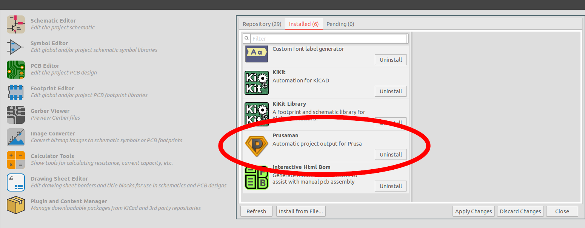

# Instalace

Instalace a aktualizace probíhá skrze správce doplňků ­— stačí stáhnout ZIP
soubor ze [vydání projektu na
GitHubu](https://github.com/prusa3d/KiKIt_fab_prusa/releases) a nainstalovat jej
skrze správce doplňků:

Následně se Prusaman zobrazí mezi doplňky:

A v Editoru PCB přibude nová knihovna:

Při prvním spuštění Editoru PCB po installaci budete vyzváni k instalaci
backendu Prusamanu. Bez backendu Prusaman nefunguje — interně se jedná o
primárně CLI nástroj (backend), ke kterému existuje grafické rozhraní.

# Aktualizace

Pro aktualizaci stačí stáhnout novou verzi ze stránek [vydání na
GitHubu](https://github.com/prusa3d/KiKIt_fab_prusa/releases), starou verzi ve
správci doplňků odinstalovat a nainstalovat novou. Při dalším spuštění editoru
PCB budete vyzvání k aktualizaci backendu.
