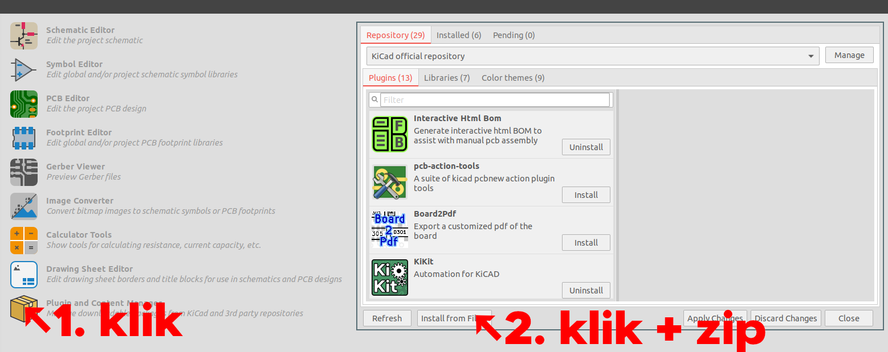

# Instalace

Instalace a aktualizace probíhá skrze správce doplňků. Pozor, pokud je KiCAD
nainstalován skrze Flatpak, pak je třeba jeden krok navíc – viz níže. Taktéž je
třeba pro správnou funkci nastavit do proměnných prostředí nebo do systémového
trezoru autentizační data.

Stáhni ZIP soubor ze [vydání projektu na
GitHubu](https://github.com/prusa3d/KiKIt_fab_prusa/releases) a nainstaluj jej
skrze správce doplňků:



Následně se Prusaman zobrazí mezi doplňky:


A v Editoru PCB přibude nová knihovna:


Při prvním spuštění Editoru PCB po installaci budeš vyzván k instalaci
backendu Prusamanu. Bez backendu Prusaman nefunguje — interně se jedná o
primárně CLI nástroj (backend), ke kterému existuje grafické rozhraní.

# Aktualizace

Pro aktualizaci stačí stáhnout novou verzi ze stránek [vydání na
GitHubu](https://github.com/prusa3d/KiKIt_fab_prusa/releases), starou verzi ve
správci doplňků odinstalovat a nainstalovat novou. Při dalším spuštění editoru
PCB budete vyzvání k aktualizaci backendu.

## Jak vyzkoušet nejnovější verzi

Prusaman má nastavené CI, které po každém commitu do repozitáře sestaví PCM
balíček. Ten je možné stáhnout a nainstalovat. Jednotlivé běhy CI jsou k
nalezení na
[https://github.com/prusa3d/KiKIt_fab_prusa/actions](https://github.com/prusa3d/KiKIt_fab_prusa/actions).
Po otevření (zpravidla posledního) běhu jsou na spodu stránky artefakty. Nás
bude zajímat artefakt s názvem "prusaman". Viz obrázek níže:


# Co mám dělat, pokud mám KiCAD nainstalovaný skrze Flatpak?

Nezoufat, a před první instalací zadat několik příkazů do terminálu:

- `flatpak run --command=sh org.kicad.KiCad`, který otevře terminál uvnitř
  Flatpak KiCAD sandboxu.
- Do tohoto terminálu zadat: `python3 -m ensurepip`. Neleknout se hromady
  výpisů.
- `exit`.

Nyní stačí spustit KiCAD a pokračovat s normální instalací. V případě, že je
třeba využívat CLI rozhraní, je třeba jej spouštět z terminálu vytvořeného
pomocí `flatpak run --command=sh org.kicad.KiCad`.

Vysvětlení: Flatpatk vytváří sandbox pro každou aplikaci. Izoluje její data a
závislosti od celého systému. Flatpak KiCADu neobsahuje pip, který je nezbytný
pro instalaci všech závislostí Prusamana. Proto je třeba "vkročit do sandboxu" a
pip nainstalovat. Stejně tak CLI rozhraní je třeba pouštět zevnitř kontejneru,
jinak Prusaman nenajde KiCAD.


# Nastavení autentizačních dat

Aby Prusaman mohl kontrolovat, že použité footprinty jsou ty nejnovější možné,
potřebuje si stáhnout předlohu z knihovny na GitHubu. K tomu potřebuje tzv.
personal access token.

Ten je možné získat dle [oficiálního návodu
GitHubu](https://docs.github.com/en/authentication/keeping-your-account-and-data-secure/creating-a-personal-access-token).
Jedná se o řetězec ve tvaru `ghp_<alfanumerické znaky>`. Prusamanovi stačí pouze
scope repo.

Jsou dva způsoby, jak je Prusamanovi poskytnout:
- přes systémový trezor (preferováno),
- nebo přes proměnnou prostředí `PRUSAMAN_GH_TOKEN` (preferováno v CI a při
  použití Flatpaku).

## Nastavení tokenu přes systémový trezor

Otevři "KiCAD Command Prompt" na Windows nebo obyčejný terminál na linuxu a
zadej příkaz:

```
keyring set prusaman github
```
A postupuj podle instrukcí. Jako heslo nastav autentizační token získaný výše.
Pozor, tento postup nefunguje při použití Flatpaku, jelikož ten znepřístupňuje
systémový trezor (kvůli sandboxu).

## Proměnná prostředí

Je vhodná zejména při automatizaci v CI. Používá se proměnná
`PRUSAMAN_GH_TOKEN`. Je možné ji ale nastavit na Windows (např. dle
[návodu](https://docs.oracle.com/en/database/oracle/machine-learning/oml4r/1.5.1/oread/creating-and-modifying-environment-variables-on-windows.html#GUID-DD6F9982-60D5-48F6-8270-A27EC53807D0)),
Linuxoví uživatelé si poradí.

Pozor: Při použití Flatpaku je třeba token nastavit danému sandboxu; tj. použít
následující příkaz:

```
flatpak override --env=PRUSAMAN_GH_TOKEN=<ghtoken> org.kicad.KiCad
```
