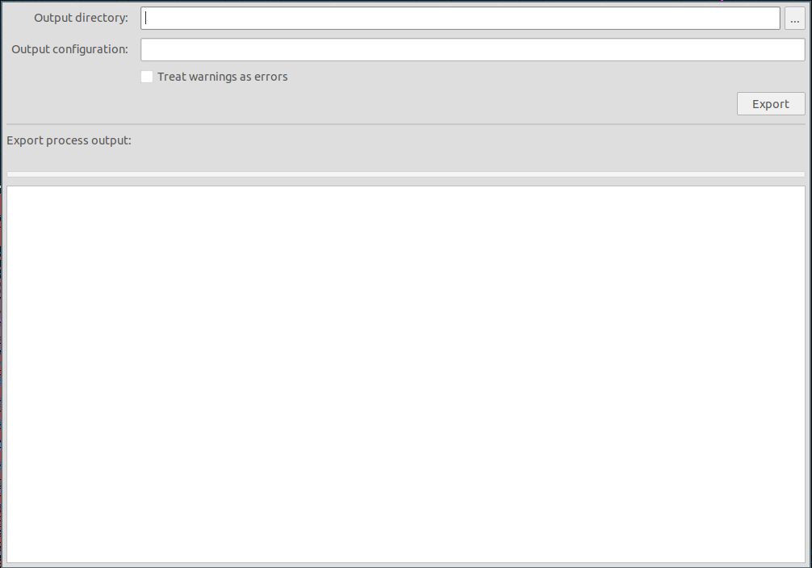

# Použití Prusamanu

Jakmile je vytvořen soubor `prusaman.yaml` a šablony readme, tak je možné
Prusaman začít používat. A to buď z CLI nebo GUI.

Prusaman generuje podklady přesně jak diktuje
[Confluence](https://cfl.prusa3d.com/pages/viewpage.action?pageId=41468219&src=breadcrumbs-parent).
Přičemž:
- soubor s pastou je generován pouze pokud je na desce nějaké lepidlo.
- soubory s lepidlem se generují z vrstvy `F.Adhes`, kde se hledají vyplňené
  kruhy o přesném poloměru. Pokud je nalazen kruh špatných parametrů či jiný
  tvar, Prusaman zahlásí chybu. Zejména tedy není nutné nahrazovat lepidlo
  footprinty `M_glue_*`, ale je možné ho mít přímo nakreslené ve značce.
  Momentálně však footprinty z knihovny `prusa_other` obsahují nekorektní kresby
  lepidla.
- pokud je použit BOM filtr `ibom` je možné vybrat, kterou konfiguraci BOMu
  vygenerovat.

## CLI

Na Windows je CLI třeba spouštět z `KiCAD Command Prompt` nikoliv z obyčejné
příkazové řádky.


```
Usage: prusaman make [OPTIONS] SOURCE OUTPUTDIR

  Make manufacturing files for a project (SOURCE) into OUTPUTDIR.

Options:
  -c, --configuration TEXT  Specify assembly configuration
  -f, --force               If existing path already contains files, overwrite
                            them.
  -s, --silent              Report only errors
  -w, --werror              Treat warnings as errors
  --help                    Show this message and exit
```

Po spuštění se ve specifikovaném adresáři objeví výstupní soubory.

## GUI

GUI je třeba spustit s otevřenou deskou daného projektu. Ovládání GUI by mělo
být intuitivní:


